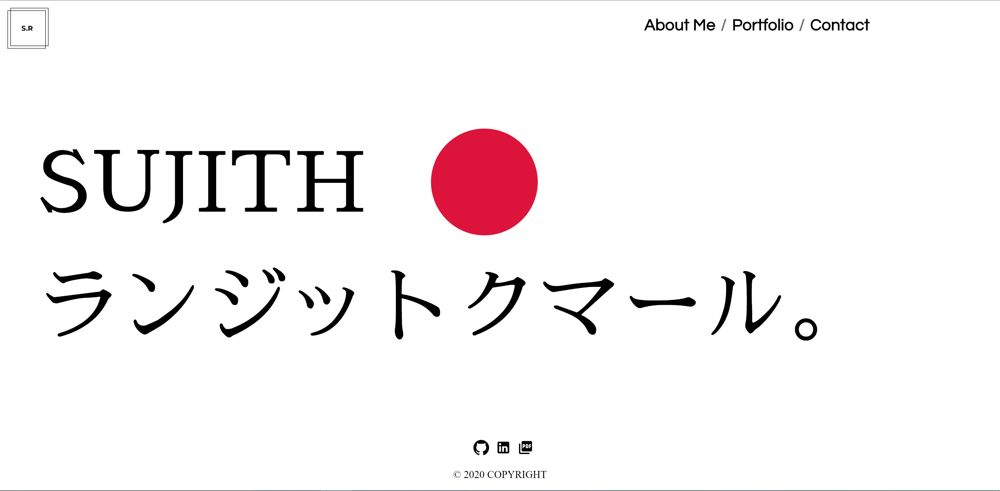
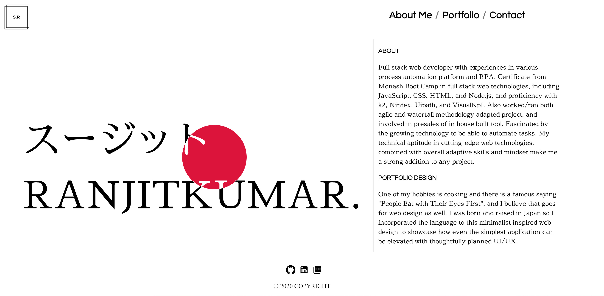
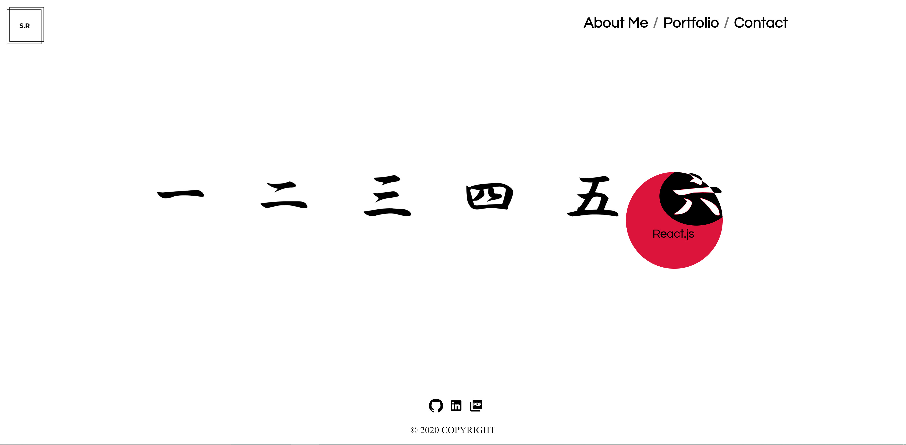
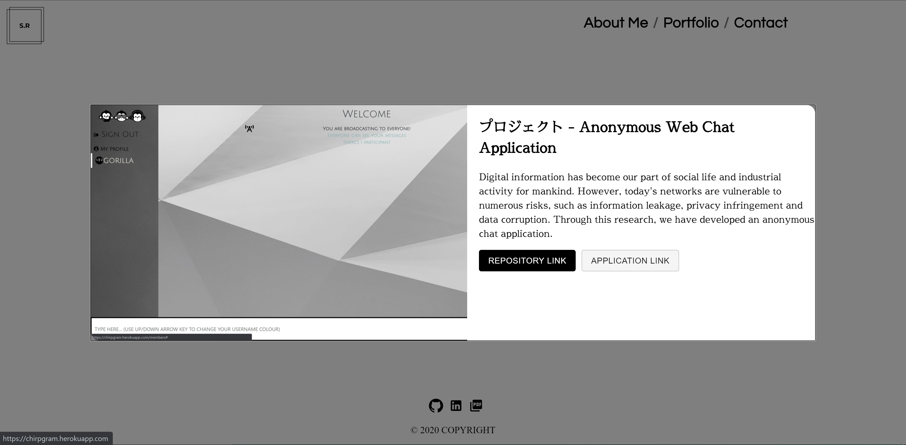
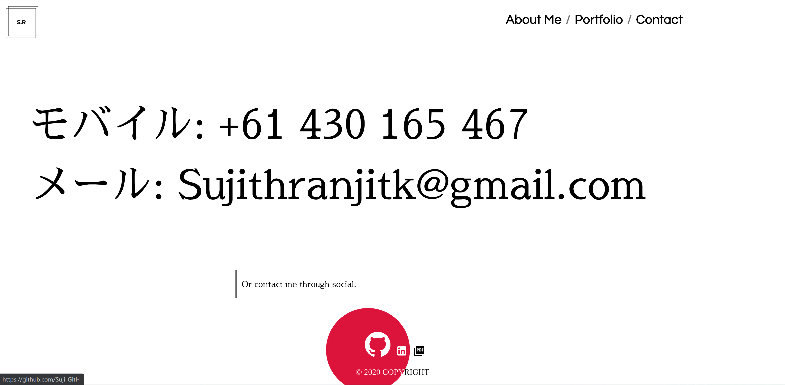

# MBC-React-Portfolio

# MBC-Portfolio-v2.0
Updated Portfolio

## Application & Repository Link

###### [Application Link]()

###### [Repository Link](https://github.com/Suji-GitH/MBC-Portfolio)

## Content
- [Overview](#Overview)
- [Acceptance Criteria](#Acceptance-Criteria)
- [UI/UX & Application Screens](#UI/UX-Application-Screens)
    - [UI/UX Consideration](#UI/UX-Consideration)
    - [App Screenshots](#App-Screenshots)
- [Credits](#Credits)
- [Testing](#Testing)

## Overview

Initial Portfolio was made with only HTML and Bootstrap CSS framework. Portfolio is completely updated with React framework. 

## Acceptance Criteria

* Updated portfolio featuring project 1 and two exemplary homework assignments. 

* Update GitHub profile with pinned repositories featuring project 1 and two exemplary assignments. 

* Updated resume

* Updated LinkedIn profile

## UI/UX Application-Screens

###### UI/UX Consideration

The main UI/UX consideration made for updating of the Portfolio is simplifying everything down to give it the minimalist design. 

User is given clearly the 3 options under the name title to explore. Each option will let the user focus on the section at hand and all open on the same landing page and not be redirected like the previous portfolio page. 

Further more animation is added for loading texts, Portfolio projects have double images which changes over hover to not crowd the screen with multiple images, any link items are opened in a new tab so user can still have access to the Portfolio Page. 

###### App Screenshots

Landing Page

AboutMe

Portfolio

Portfolio Modal

Contact

## Credits

- React.js
- MaterialUI
- Node.js
- Framer-motion
- React-router-dom

## Testing

As an System, when the user lands on My Portfolio page, they are presented with title(Sujith), header, footer, and logo. 

As a User, when I click on "AboutMe" user is shown with bio about me. 

As a User, when I click on "Portfolio", I am presented with six Portfolio Projects. 

As a User, when I click on one of the Portfolio project, modal is opened with application screenshot, project description, buttons to repository and application link. 

As a User, when I click on Repository or Application link button, I am redirected in a new tab to the correct link directory.

As a User, when I click on Contact, number and email is shown.

As a User, when I click on GitHub or linkedIn button, I am redirected in a new tab to the correct link directory.
